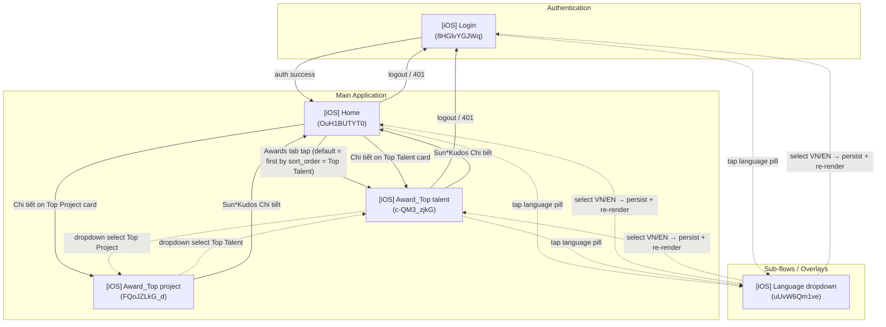

# Screen Flow Overview

## Project Info
- **Project Name**: SAA 2025 (Sun* Annual Awards 2025)
- **Platform Target**: Android (Kotlin + Jetpack Compose + Material 3) — iOS-labeled MoMorph frames are reused as the visual reference and compiled to Android.
- **Figma File Key**: 9ypp4enmFmdK3YAFJLIu6C
- **Figma URL**: https://www.figma.com/design/9ypp4enmFmdK3YAFJLIu6C
- **Created**: 2026-05-08
- **Last Updated**: 2026-05-11

---

## Discovery Progress

| Metric | Count |
|--------|-------|
| Total Screens | 5 |
| Discovered | 5 |
| Spec Shipped | 5 |
| Spec In Progress | 0 |
| Completion | 100% |

---

## Screens

| # | Screen Name | screenId | Figma Link | Status | Detail File | Parent Flow(s) | Outbound Edges |
|---|-------------|----------|------------|--------|-------------|----------------|----------------|
| 1 | [iOS] Login | 8HGlvYGJWq | https://www.figma.com/design/9ypp4enmFmdK3YAFJLIu6C?node-id=8HGlvYGJWq | spec_shipped | specs/8HGlvYGJWq-iOS-Login/spec.md | (entry) | Home (on success), Language dropdown (sub-flow) |
| 2 | [iOS] Home | OuH1BUTYT0 | https://www.figma.com/design/9ypp4enmFmdK3YAFJLIu6C?node-id=OuH1BUTYT0 | spec_shipped | specs/OuH1BUTYT0-iOS-Home/spec.md | Login (post-auth) | Login (on logout / 401), Language dropdown (sub-flow) |
| 3 | [iOS] Language dropdown | uUvW6Qm1ve | https://www.figma.com/design/9ypp4enmFmdK3YAFJLIu6C?node-id=uUvW6Qm1ve | spec_shipped | specs/uUvW6Qm1ve-iOS-Language-dropdown/spec.md | Login (8HGlvYGJWq), Home (OuH1BUTYT0) | none — selection re-renders strings on parent |
| 4 | [iOS] Award_Top talent | c-QM3_zjkG | https://www.figma.com/design/9ypp4enmFmdK3YAFJLIu6C?node-id=c-QM3_zjkG | spec_shipped | specs/c-QM3_zjkG-iOS-Award-Top-talent/spec.md | Home (Awards-tab nav, Chi tiết carousel tap) | Login (on 401), Sun*Kudos (Chi tiết tap) |
| 5 | [iOS] Award_Top project | FQoJZLkG_d | https://www.figma.com/design/9ypp4enmFmdK3YAFJLIu6C?node-id=FQoJZLkG_d | spec_shipped (delta-spec) | specs/FQoJZLkG_d-iOS-Award-Top-project/spec.md | Award_Top talent (dropdown select), Home (Chi tiết carousel tap on Top Project card) | Same as canonical Award Detail — renders through the same parametric AwardDetailScreen composable |

---

## Navigation Graph

> Dotted edges denote a sub-flow / overlay relationship: the dropdown does not push a new route — it anchors to the language-pill control on its parent and dismisses back to the same parent screen. The Award_Top talent ↔ Award_Top project dotted edges are sibling-state transitions — both render through the same parametric `AwardDetailScreen` composable; the dropdown swap is an in-place re-render, not a navigation transition. Awards-related language-pill edges are shown only on Top Talent (Top Project inherits the same chrome behaviour as the canonical parametric screen).

---

## Screen Groups

### Group: Authentication
| Screen | Purpose | Entry Points |
|--------|---------|--------------|
| [iOS] Login (8HGlvYGJWq) | Supabase email/password auth | App launch, Logout from Home, 401 from Home |

### Group: Main Application
| Screen | Purpose | Entry Points |
|--------|---------|--------------|
| [iOS] Home (OuH1BUTYT0) | Awards hub: US1 hub view + US2 awards carousel + detail | Login success |
| [iOS] Award_Top talent (c-QM3_zjkG) | Parametric Award Detail screen — body re-renders per dropdown selection across all award categories. Top Talent is the default render (first by `sort_order`). | Home Awards-tab bottom-nav + Chi tiết on Top Talent carousel card |
| [iOS] Award_Top project (FQoJZLkG_d) | Same parametric Award Detail screen rendered with Top Project as the default selection. Delta-spec — see `c-QM3_zjkG` for the canonical behaviour contract. | Home Chi tiết on Top Project carousel card + Award_Top talent dropdown select "Top Project" |

### Group: Sub-flows / Overlays
| Screen | Purpose | Entry Points |
|--------|---------|--------------|
| [iOS] Language dropdown (uUvW6Qm1ve) | Surfaces VN / EN options and persists selection via `LanguagePreferenceRepository`. Same `LanguageSelector` Compose component shared by Login and Home. (Figma frame enumerates only VN + EN — see spec § Out of Scope for the JA removal.) | Language pill in Login header, Language pill in Home header |

---

## Shared Components

| Component | Used By | Notes |
|-----------|---------|-------|
| `LanguageSelector` | Login header, Home header, Award Detail header | Anchors the [iOS] Language dropdown sub-flow. Selection writes to `LanguagePreferenceRepository`; consumers observe and recompose strings. No navigation occurs on select. |
| `HomeHeader` | Home, Award Detail | Same chrome on every authenticated screen (logo + language pill + search + bell). The "lift-to-`core/chrome/ui`" refactor is deferred — currently imported as-is from `home/ui/components`. |
| `HomeBottomBar` | Home, Award Detail | Same bottom nav (SAA 2025 / Awards / Kudos / Profile). Re-tap of the active tab on Award Detail scrolls the body to the top (canonical Q2 + commit `0293084`). |
| `KudosSection` | Home, Award Detail | The Sun\*Kudos promo block at the bottom of the body — both screens' Chi tiết CTAs funnel to `Routes.KUDOS_OVERVIEW`. |
| `AwardDetailScreen` (parametric) | Award_Top talent + Award_Top project frames (and future Top Heart, MVP, Best Manager, Signature 2025 — Creator) | Single composable parameterised by `awardId`. Dropdown swap is an in-place re-render via `AwardDetailViewModel.onCategorySelected`, NOT a screen-level navigation transition. |

---

## Discovery Log

| Date | Action | Screens | Notes |
|------|--------|---------|-------|
| (prior) | Initial spec | [iOS] Login (8HGlvYGJWq) | Supabase auth integration, Sunner verification |
| (prior) | Spec + impl | [iOS] Home (OuH1BUTYT0) | Phases 1–4 shipped (UI scaffold, domain, US1 hub, US2 carousel) |
| 2026-05-08 | Spec started | [iOS] Language dropdown (uUvW6Qm1ve) | Sub-flow anchored from language-pill on Login + Home headers; status: spec_in_progress |
| 2026-05-08 | Spec ratified | [iOS] Language dropdown (uUvW6Qm1ve) | Review pass + 4 Q&A resolved (drop JA, VN-default global, silent JA fallback, silent write-failure). Status flipped to `spec_shipped`. |
| 2026-05-11 | Spec + plan + tasks + impl shipped | [iOS] Award_Top talent (c-QM3_zjkG) | Parametric Award Detail screen. 103 tasks across Phases 0–8 (commits `4e830b9` → `26f8ef8`). Resolved Q1 (default = last-viewed in-session, fallback first by sort_order), Q2 (Awards-tab retap scroll-to-top), Q3 (both Chi tiết → KUDOS_OVERVIEW), Q5 (prize_value pre-formatted), Q6/Q7/Q8 (implementer discretion). |
| 2026-05-11 | Delta-spec authored | [iOS] Award_Top project (FQoJZLkG_d) | Lightweight delta-spec referencing canonical c-QM3_zjkG (commit `daaf526`). Same parametric AwardDetailScreen — only DEMO payload differs. Resolved Q-TP-1 (DEMO description / quantity / unit / prizeValue aligned with Figma node `6885:10468`) + Q-TP-2 (zero-pad single-digit quantities — `2 → "02 Tập thể"`, commit `9366e39`). |
| 2026-05-11 | Slice D test backfill shipped | Award Detail (cross-frame) | 33 instrumented + unit tests across 5 files (commit `d69a6c8`): AwardInfoBlockTest (Q-TP-2 regression), DemoAwardsRepositoryTest (Q-TP-1 regression), AwardDetailScreenTest, AwardCategoryDropdownTest, BottomNavAwardsTabTest. Closes canonical T026–T056 evidence gap (tasks marked [x] without test files existing). Also bumps mockk 1.13.13 → 1.14.3 for 16KB-page alignment. |
| 2026-05-11 | Slice A badge bundle shipped | [iOS] Award_Top project (FQoJZLkG_d) | Top Project Figma badge composite bundled (commit `1417e25`). MoMorph composite endpoint returned null → fell back to downloading BG (160×160) + wordmark (106×16) layers separately and compositing offline with Python + Pillow. DemoAwardsRepository.DEMO_DETAILS[1].imageUrl flipped null → resource URI. |

---

## Next Steps

- [x] Author `specs/uUvW6Qm1ve-iOS-Language-dropdown/spec.md` covering: dropdown anchoring, VN/EN option rows, selected-state, dismiss behaviour, persistence via `LanguagePreferenceRepository`, re-render contract on parent. — **Drafted 2026-05-08; reviewed + ratified 2026-05-08.**
- [x] Review pass — 4 Q&A resolved 2026-05-08 (Q1 drop JA, Q2 VN-default global, Q3 silent JA fallback, Q4 silent DataStore-write-failure).
- [ ] Run `momorph.plan` for the Language dropdown spec to produce a feature plan + tasks. The plan must include:
   - Removal of JA from `Language.entries` + the `LanguageSelector` row list.
   - DataStore decoder fallback to VN for unknown / orphaned values.
   - Localised `contentDescription` updates so TalkBack re-announces the new selection on language change.
   - Touch-target tests on anchor + each row, mirroring Login's `TouchTargetTest`.
- [ ] Drop `values-ja/strings.xml` from the active `StringResourceParityTest` set when the JA removal lands; keep the file on disk for one release cycle.
- [ ] Future Award delta-specs (Top Heart, MVP, Best Manager, Signature 2025 — Creator) follow the same delta-spec pattern as `FQoJZLkG_d-iOS-Award-Top-project`. Each is a 1-page spec referencing canonical `c-QM3_zjkG-iOS-Award-Top-talent/spec.md`; the implementer's job is (a) update DEMO row + production Supabase `awards` row, (b) bundle the Figma badge composite, (c) author a delta-plan + tasks if either of the prior shifts surfaces a frame-specific Q-number. **Do not author a duplicate 750-line spec per frame.**
