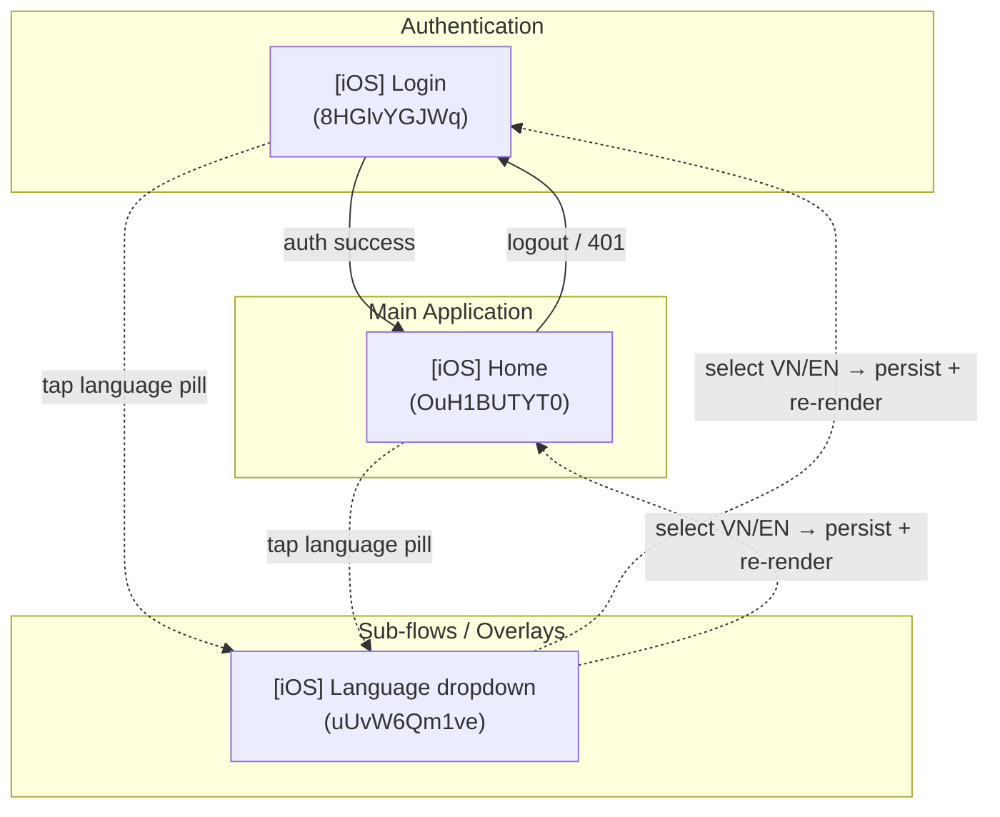

# Screen Flow Overview

## Project Info
- **Project Name**: SAA 2025 (Sun* Annual Awards 2025)
- **Platform Target**: Android (Kotlin + Jetpack Compose + Material 3) — iOS-labeled MoMorph frames are reused as the visual reference and compiled to Android.
- **Figma File Key**: 9ypp4enmFmdK3YAFJLIu6C
- **Figma URL**: https://www.figma.com/design/9ypp4enmFmdK3YAFJLIu6C
- **Created**: 2026-05-08
- **Last Updated**: 2026-05-08

---

## Discovery Progress

| Metric | Count |
|--------|-------|
| Total Screens | 3 |
| Discovered | 3 |
| Spec Shipped | 3 |
| Spec In Progress | 0 |
| Completion | 100% |

---

## Screens

| # | Screen Name | screenId | Figma Link | Status | Detail File | Parent Flow(s) | Outbound Edges |
|---|-------------|----------|------------|--------|-------------|----------------|----------------|
| 1 | [iOS] Login | 8HGlvYGJWq | https://www.figma.com/design/9ypp4enmFmdK3YAFJLIu6C?node-id=8HGlvYGJWq | spec_shipped | specs/8HGlvYGJWq-iOS-Login/spec.md | (entry) | Home (on success), Language dropdown (sub-flow) |
| 2 | [iOS] Home | OuH1BUTYT0 | https://www.figma.com/design/9ypp4enmFmdK3YAFJLIu6C?node-id=OuH1BUTYT0 | spec_shipped | specs/OuH1BUTYT0-iOS-Home/spec.md | Login (post-auth) | Login (on logout / 401), Language dropdown (sub-flow) |
| 3 | [iOS] Language dropdown | uUvW6Qm1ve | https://www.figma.com/design/9ypp4enmFmdK3YAFJLIu6C?node-id=uUvW6Qm1ve | spec_shipped | specs/uUvW6Qm1ve-iOS-Language-dropdown/spec.md | Login (8HGlvYGJWq), Home (OuH1BUTYT0) | none — selection re-renders strings on parent |

---

## Navigation Graph

> Dotted edges denote a sub-flow / overlay relationship: the dropdown does not push a new route — it anchors to the language-pill control on its parent and dismisses back to the same parent screen.

---

## Screen Groups

### Group: Authentication
| Screen | Purpose | Entry Points |
|--------|---------|--------------|
| [iOS] Login (8HGlvYGJWq) | Supabase email/password auth | App launch, Logout from Home, 401 from Home |

### Group: Main Application
| Screen | Purpose | Entry Points |
|--------|---------|--------------|
| [iOS] Home (OuH1BUTYT0) | Awards hub: US1 hub view + US2 awards carousel + detail | Login success |

### Group: Sub-flows / Overlays
| Screen | Purpose | Entry Points |
|--------|---------|--------------|
| [iOS] Language dropdown (uUvW6Qm1ve) | Surfaces VN / EN options and persists selection via `LanguagePreferenceRepository`. Same `LanguageSelector` Compose component shared by Login and Home. (Figma frame enumerates only VN + EN — see spec § Out of Scope for the JA removal.) | Language pill in Login header, Language pill in Home header |

---

## Shared Components

| Component | Used By | Notes |
|-----------|---------|-------|
| `LanguageSelector` | Login header, Home header | Anchors the [iOS] Language dropdown sub-flow. Selection writes to `LanguagePreferenceRepository`; consumers observe and recompose strings. No navigation occurs on select. |

---

## Discovery Log

| Date | Action | Screens | Notes |
|------|--------|---------|-------|
| (prior) | Initial spec | [iOS] Login (8HGlvYGJWq) | Supabase auth integration, Sunner verification |
| (prior) | Spec + impl | [iOS] Home (OuH1BUTYT0) | Phases 1–4 shipped (UI scaffold, domain, US1 hub, US2 carousel) |
| 2026-05-08 | Spec started | [iOS] Language dropdown (uUvW6Qm1ve) | Sub-flow anchored from language-pill on Login + Home headers; status: spec_in_progress |
| 2026-05-08 | Spec ratified | [iOS] Language dropdown (uUvW6Qm1ve) | Review pass + 4 Q&A resolved (drop JA, VN-default global, silent JA fallback, silent write-failure). Status flipped to `spec_shipped`. |

---

## Next Steps

- [x] Author `specs/uUvW6Qm1ve-iOS-Language-dropdown/spec.md` covering: dropdown anchoring, VN/EN option rows, selected-state, dismiss behaviour, persistence via `LanguagePreferenceRepository`, re-render contract on parent. — **Drafted 2026-05-08; reviewed + ratified 2026-05-08.**
- [x] Review pass — 4 Q&A resolved 2026-05-08 (Q1 drop JA, Q2 VN-default global, Q3 silent JA fallback, Q4 silent DataStore-write-failure).
- [ ] Run `momorph.plan` for the Language dropdown spec to produce a feature plan + tasks. The plan must include:
   - Removal of JA from `Language.entries` + the `LanguageSelector` row list.
   - DataStore decoder fallback to VN for unknown / orphaned values.
   - Localised `contentDescription` updates so TalkBack re-announces the new selection on language change.
   - Touch-target tests on anchor + each row, mirroring Login's `TouchTargetTest`.
- [ ] Drop `values-ja/strings.xml` from the active `StringResourceParityTest` set when the JA removal lands; keep the file on disk for one release cycle.
